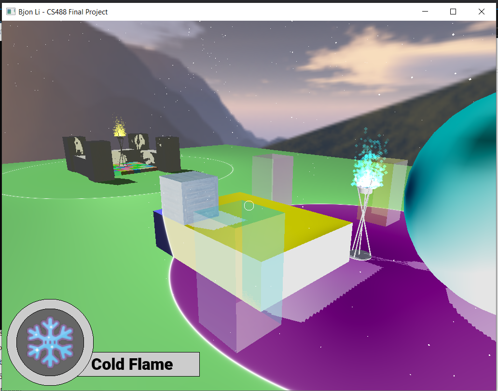

# Transcendent Lanterns

This final project for CS488 is an Interactive "Game" using OpenGL. In this application, a user can walk around a scene and interact with lanterns. The user can light up or extinguish the lantern. When lit, every object/region within some radius of that lantern, called the lantern's region of influence (ROI), will be rendered in a different way depending on the type of flame. 

In particular:
- The Normal Flame leaves the surreounding area as is
- The Gloomy Flame turns everything in the lanterns ROI into greyscale
- The Happy Flame performs cel shading in its ROI. It also turn translucent objects completley opaque
- The Cold Flame inverts the colours of all objects in its ROI

## About the project

## Controls
If applicable, the ten objectives for this project can be toggled with the keys 1-0 respectively. For example, the skybox can be runed on and off with the Key 9. A full list of objectives is found at the end. 

Moving the mouse turns the player. If looking at a lantern, the user can ignite and extinguish the lantern by clicking on the lantern with the left mouse button. When igniting, the lantern will use the flame that is currently selected. The Q and E keys rotate between the selected flame. 

The player can move around using the WASD keys. The player has three modes of movement: Fly, Ghost, Walk. The player is initially in Fly Mode. The player can switch modes using the Hotkey 2. 

In Fly and Ghost Mode, The R and F keys moves the player up and down respectively. In Ghost mode, the player can phase through objects; Static collision is implemented in Walk mode. 

In Walk mode, the SPACE key will allow the player to jump if on the ground. 

The T key can be used to toggle the HUD on and off. 

The ESC key closes the application.

## Dependencies
The following external libraries have been used in the project

- [Freetype](https://freetype.org/) is a library that parses and renders font files
- [GLFW3](https://www.glfw.org/) is a library for OpenGL
- [irrKlang](https://www.ambiera.com/irrklang/) is a sound library for sound effects
- [stb](https://github.com/nothings/stb) is used for reading jpg and png images. The stb_image.h file has been directly copied into the src directory. 

## Building and Running

Firstly, this the object files for the above libraries will have to be found and added. For Windows, this includes
- freetype.dll
- freetype.lib
- glfw3.dll
- libglfw3dll.a
- ikpKlang.dll
- ikpFlac.dll
- irrKlang.lib 

This project was done using [Visual Studio](https://visualstudio.microsoft.com/), and was set up such that the .dll and .a files were under `${ProjectDir}/dlls` and the .lib files were under `${ProjectDir}/lib`.

To Build and Run using Visual Studio:
1. Open the project through the `GraphicsProject.sln` file
2. Switch from Debug mode to Release
3. Build the project via Build > Build GraphicsProject
4. Run the executable found under ` ${ProjectDir}\x64\Release`

The environment is set up so that during a build, all assets and relevant dlls gets copied to the Output directory. As such, the executable should run fine from there.

## Assets

### Fonts
The Roboto-Black.ttf was made by [Christian Robertson](https://www.fontsquirrel.com/fonts/roboto) and source from [FontSquirrel](https://www.fontsquirrel.com/) 

### Objects
The monkey.obj file was taken directly from Blender. All other .obj files were either from prior CS488 assignments or made by me on Blender.

### Sounds
Sound files were taken from https://freesound.org

- match_strike.wav sourced from [Bertsz](https://freesound.org/people/Bertsz/sounds/524306/).
- dire.flac sound sourced from [FoleyHaven](https://freesound.org/people/Foleyhaven/sounds/624425/)
- extinquish.wav sourced from [EminYILDIRIM](https://freesound.org/people/EminYILDIRIM/sounds/544634/)
- steps.wav sourced from [cris](https://freesound.org/people/cris/sounds/167686/)

### Textures and Sprites

- crate.jpg by [Katsukagi](https://3dtextures.me/2021/02/12/wood-crate-001/) from https://3dtextures.me
- a4.png is my submission for a prior CS488 assignment.

The following were taken from [Pexels](https://www.pexels.com/).
- table-wood.jpg by [FWStudio](https://www.pexels.com/photo/brown-parquet-172276/)
- wall-wood.jpg by [FWStudio](https://www.pexels.com/photo/brown-wooden-surface-172278/)
- floor-wood.jpg by [FWStudio](https://www.pexels.com/photo/brown-wooden-parquet-flooring-129731/)
- painting.jpg by [Steve Johnson](https://www.pexels.com/photo/red-white-and-blue-abstract-painting-1606591/)
- rocks.png by [Life of Pix](https://www.pexels.com/photo/gray-rock-8892/)

The icons used in the HUD were taken from https://icons8.com. This includes:
- [fire.png](https://icons8.com/icon/80847/fire) icon 
- [cloud.png](https://icons8.com/icon/42789/cloud) icon 
- [sun.png](https://icons8.com/icon/21106/sun) icon 
- [snowflake.png](https://icons8.com/icon/66178/snowflake) icon

The mountian skybox was sourced from [Joelll](https://www.cleanpng.com/png-desktop-wallpaper-computer-mountain-sky-plc-6017400/).

## Objectives

The following are the ten main objectives for the Project. If applicable, totkeys 0-9 are binded to toggle each of the ten objectives respecitvely.

1.  UI allows user to walk around scene, light/extinguish lanterns, and change selected flame. 
2. Static collision 
3. Objects in a lanterns ROI will are rendered in a different style. A white border appears on the perimeter of the ROI.
4. Cel shading 
5. Particle Systems
6. Synchonous Sound 
7. Textures mapping
8. Shadows
9. Skybox
10. Transparency

## Other Things

Bless [LearnOpenGL.com](https://learnopengl.com/) for teaching me how to implement various graphics techniques. 